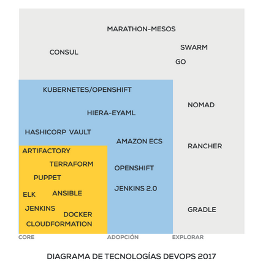
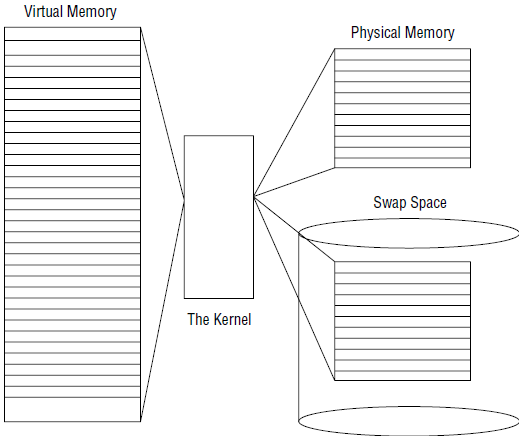
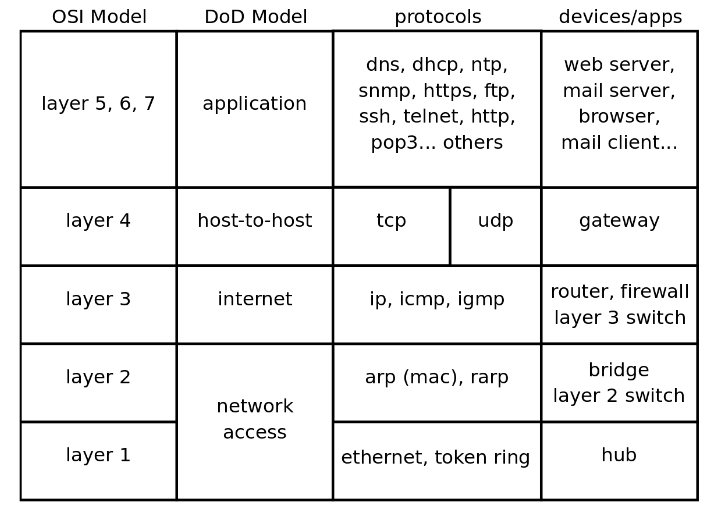
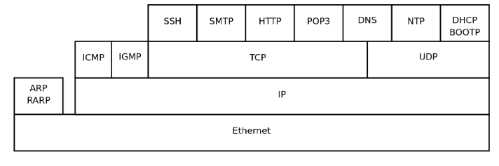
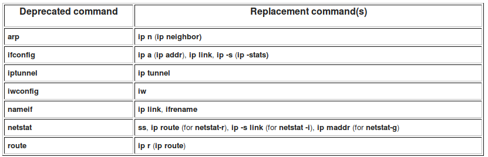
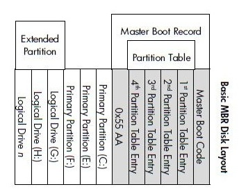
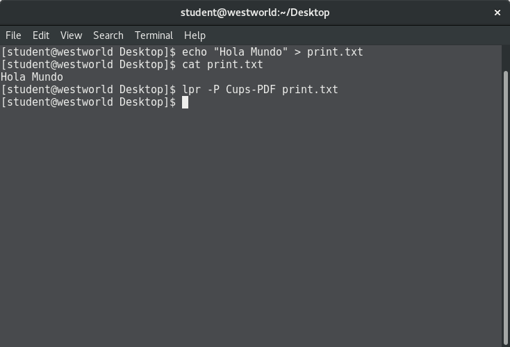
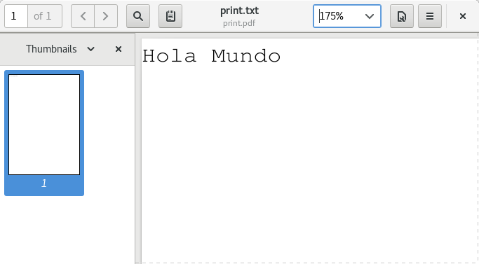

```{r setup, include=FALSE}
knitr::opts_chunk$set(echo = FALSE)
```


# Inducción a BEEVA

# Introduction

## DevOps

DevOps es un acrónimo inglés de development (desarrollo) y operations (operaciones), que se refiere a una cultura o movimiento centrado en la comunicación, colaboración e integración entre desarrolladores de software y los profesionales en las tecnologías de la información (IT). Automatiza el proceso de entrega del software y los cambios en la infraestructura. Su objetivo es ayudar a crear un entorno donde la construcción, prueba y lanzamiento de un software pueda ser más rápido y con mayor fiabilidad.

Las empresas con entregas (releases) muy frecuentes podrían requerir conocimientos de DevOps. Flickr desarrolló un sistema DevOps para cumplir un requisito de negocio de diez despliegues al día. A este tipo de sistemas se les conoce como despliegue continuo (continuous deployment) o entrega continua (continuous delivery), y suelen estar asociados a metodologías lean startup. Grupos de trabajo, asociaciones profesionales y blogs usan el término desde 2009.

[Fuente](https://es.wikipedia.org/wiki/DevOps)

## DevOps


## Mapa




# Introduction to Linux Server

## Linux

GNU/Linux, es el término empleado para referirse a la combinación del sistema operativo GNU, desarrollado por la FSF, y el núcleo(kernel) Linux, desarrollado por Linus Torvalds y la Linux Foundation. Su desarrollo es uno de los ejemplos más prominentes de software libre; todo su código fuente puede ser utilizado, modificado y redistribuido libremente por cualquiera bajo los términos de la GPL (Licencia Pública General de GNU) y otra serie de licencias libres.

[Fuente](https://es.wikipedia.org/wiki/GNU/Linux)

## Components of a Linux System

* The Linux Kernel
* The GNU utilities
* A graphical desktop environment (not always)
* Application software

## Kernel responsabilities

* System memory management
* Software program management
* Hardware management
* Filesystem management


## The Linux system memory map



## Filesystems

* ext
* ext2
* ext3
* ext4
* NFS
* NTFS

## Core GNU Utilities

* Handling files
* Manipulating text
* Managing processes

## The Shell

```
#
$
```

* zsh
* korn
* tcsh
* ash

## On the Desktop

* The X Window system
* KDE
* GNOME
* Unity
* LXDE
* XFCE

## Distributions

* Debian/Ubuntu/Mint
* Red Hat/Fedora/CentOS
* SUSE/OpenSUSE
* Slackware
* Arch
* Knopix
* Gentoo

## Back to the Shell

Linux displays by default a console terminal if the graphical interface is not set in the boot sequence.

You can access to the virtual consoles by using `Ctrl+Alt+F1` to `F7`

TTY: Short for TeleTYpewriter

## Consoles

```
setterm --inversescreen on
```

* Final Term
* Eterm
* Konsole
* UXTerm
* xterm
* Terminator


# Basic Shell Commands

## Starting the Shell

Prompt

```
raze@linuxserver01:~$
root@linuxserver01:~#
```

## Man pages

```
man command
```

* Name
* Synopsis
* Configuration
* Description
* Options
* Exit Status
* Return Value
* Errors
* Environment
* Files
* Versions

## Navigating the filesystem

```
cd /home
cd
cd ~
pwd
cd /var/log
cd ../../
```

## Common Linux Directory Names

```
/       Root of the virtual directory, no files
/bin    Binary directory, many GNU utilities stored
/boot   Boot directory, boot files
/dev    device directory, where Linux creates device nodes
/etc    system configuration files directory
/home   Home directory, where user's dirs are created
/lib    Library directory, system and application library files
/media  media directory, a common place for mount points (removable media)
/mnt    mount directory, another common place for mount points
/opt    optional directory, often used to store third party software packages
/proc   process dir, current hardware and process information
/root   root home directory
/sbin   system binary
/run    run dir, runtime data
/srv    service dir, where local services store their files
/sys    system dir, system hardware information files are stored
/tmp    temporary dir, where temporary work files can be created
/usr    user binary directory
/var    variable directory, files that change frequently, logs for example
```

## Listing files

```
ls
ls -la
ls -a
# Distinguish files of directories
ls -F
# recursive
ls -F -R
# wildcards
? # one character
* # any number of characters
```

## Interacting with directories and files

```
touch my_file
ls -l my_file
touch .
cp my_file my_file_copy
ls -l my_file*
# move to rename
mv my_file original_file
rm my_file*
mv original_file ../my_file
```

## More on directories

```
mkdir my_dir
touch my_dir/file
mkdir parent_dir
cp -R my_dir parent_dir
rm -R my_dir
mv parent_dir/my_dir ./backup
```

## Linking files

There are two types of links in the Linux filesystems:

* Symbolic link
* A hard link

```
touch data_file
ln -s data_file linked_file
ls -l *_file
ls -i *_file
# Hard link
ln data_file hard_linked_file
```

## Viewing files

```
tree parent_dir
cat data_file
file data_file
# adds numbers
cat -n another.file
# numbers the lines with content
cat -b another.file
# supress tabs
cat -T another.file
```

## More on viewing files

```
more data_file
less data_file
head data_file
```

## Viewing logs

```
tail -f log_file
tail -n 2 log_file
```

## Monitoring programs

```
ps
# check a particular proces
ps aux | grep java
# for other linux/**ux
ps -efa | grep process
```

## Real time monitoring

```
top
```

## Stopping processes


One does not simply kill -9

```
Ctrl+C
kill -15 pid
kill -SIGTERM pid
killall http*
```

## Monitoring memory

```
free -m
top
```

## Monitoring Disk Space

```
df -h
du -sh /*
```

## Users

```
cat /etc/passwd
who
whoami
```

## Debian based Package System

APT is a set of core tools found inside the Debian operating system. It provides utilities for the installation and removal of software packages and dependencies on a system.

`apt-get` is the high level command line tool to manage packages on a debian based system. Some options:

`apt-cache` provides an interface to perform read-only operations on the APT package cache.

`dpkg` low level package manager for Debian


## `apt-get`

Some options

* `install` and `--reinstall`
* `remove`
* `purge` or `--purge`
* `upgrade`
* `update`
* `clean` and `autoclean`

## Managing packages

```
sudo apt-get install [package-name]
sudo apt-get remove [package-name]
# uninstall with its configuration files
sudo apt-get purge [package-name]
# update package index
sudo apt-get update
# install updates
sudo apt-get upgrade -y
# If you want to force reinstall a package
sudo apt-get --reinstall install
```

## APT cache files

Cache files are located in:

* `/var/cache/apt/archives/`

```
# cleans the apt cache
sudo apt-get clean
# remove useless files from the apt cache
sudo apt-get autoclean
```

## List all available packages

```
apt-cache pkgnames
apt-cache pkgnames | more
```

## Searching for a specific debian package

```
apt-cache search "ufw"

```

## Show debian package information

```
apt-cache show vim
```


## `dpkg`

Install a package

```
dpkg -i [debian-package_amd64.deb]
dpkg --install [debian-package_amd64.deb]
```

## Remove a package

```
dpkg --remove [package-name]
dpkg -r [package-name]
# remove with its configuration files
dpkg --purge [package-name]
```

## List available system packages

```
dpkg -l [package-name-pattern]
```

## List files in a package

```
dpkg -L [package-name]
dpkg --contents [debian-package_i386.deb]
```

## Show package information

```
dpkg -s [package-name]
```

## More info

```
man apt-get
man apt
man apt-cache
man dpkg
```

## Users

```
useradd newuser
passwd newuser
groupadd newgroup
usermod newuser -G newgroup
useradd newuser1 -G newgroup
su newuser
id
```


## Red Hat Package Manager

rpm is to dpkg as yum is to apt-get.

```
# install
rpm -i [rpm-package.rpm]
# with progress bar
rpm -ivh [rpm-package.rpm]
# debug mode
rpm -ivvvh mode
# uninstall
rpm -e [package-name]
# upgrade
rpm -U [package-name.rpm]
# list all installed packages
rpm -qa | grep foo
```

## Yellowdog Update Manager

```
yum help
yum list available
yum list installed
yum info [package-name]
yum search [package-name]
yum grouplist
yum repolist
yum install [package-name]
yum update
yum remove [package-name]
```

[More info](https://access.redhat.com/articles/yum-cheat-sheet)

## The Linux Text Editors

* Vi
* Vim
* Nano
* Gedit
* Emacs
* Pico
* ...

## Vi 

The default editor that comes with the UNIX operating system is called vi (visual editor).

```
vi file
```

Shortcuts

```
G - Go to the end of a file
$ - Go to the end of a line
j - Key down
k - Key up
l - Key right
h - Key left
x - remove current character
i - Interactive mode / Insert before cursor
dd - delete current line
a - interactive mode plus one space / Insert after cursor
r - replace character
R - replace many characters
w - move to the next word
0 - move to the begining of a line
```

## Use Streams

A Linux shell, such as Bash, receives input and sends output as sequences or streams of
 characters. Each character is independent of the one before it and the one after it. The characters
are not organized into structured records or fixed-size blocks. Streams are accessed using file
IO techniques, whether or not the actual stream of characters comes from or goes to a file, a
keyboard, a window on a display, or some other IO device. Linux shells use three standard I/O
streams, each of which is associated with a well-known file descriptor:

* `stdout` is the standard output stream, which displays output from commands. It has file descriptor 1.
* `stderr` is the standard error strream, which dsplays error output from commands. It has file descriptor 2.
* `stdin` is the standard input stream, which provides input to programs. It has file descriptor 0.

## Streams


## Redirects

There are two ways of redirect output to a file:

```
n>
```
Redirects output from file descriptor n to a file. You must have write authority to the file. If the file doesn't exist, it is created. If it does exist, the existing contents are usually lost without any warning.

```
n>>
```
Also redirects output from file descriptor n to a file. Again, you must have write authority to the file. If the file doesn't exist, it is created. If it does exist, the output is appended to the end of the file.

## Avoid ovwerwritting with noclobber

```
set -o noclobber
```

## Redirecting two streams to one file

```
ls an* az* &> output.txt
ls an* az* > output.txt 2>&1
```

## Ignoring output with /dev/null

```
ls an* az* > output.txt 2>/dev/null
```

## Input redirection

```
echo -e "1 apple\n2 pear\n3 banana" > text1
tr ' ' '\t'<text1
```

## Input redirection with a here-document

```
sort <<END
hello
abc
cba
bac
END
```

Another example

```
cat > out.txt <<EOF
This
is
a
very
long
text
EOF
```

## Piping with |

Input can come from parameters you supply to commands, and output can be displayed on your terminal. Many text processing commands (filters) can take input either from the standard input stream or from a file. To use the output of a command, command1, as input to a filter, command2, you connect the commands using the pipe operator (|). Listing 1 shows how to pipe the output of echo to sort a small list of words.

```
echo -e "apple\npear\nbanana"|sort
ps -A | more
dmesg | head -3 | tail -1
ls | head -3 | tail -1 > myoutput
ls -l /etc | tail -n +2 | sort
```

## Grep

grep basically searches. More precisely, 

```
grep foo file
cat > file <<EOF
big
bad bug 
bag
bigger
boogy
EOF
```

returns all the lines that contain a string matching the expression "foo" in the file "file".

## Wildcards and Escape


* `.` matches exactly one character
* `.*` matches with any string

```
grep "b.*g" file
grep "b.*g." file
grep "ggg*" file
```

Be careful with `*`, it means repetition, not a wildcard as you use it in Unix/POSIX. It matches zero or more times. The pattern `g*` matches the string "", "g", "gg", etc. Likewise, `gg*` matches "g", "gg", "ggg", so "ggg*" matches "gg", "ggg", "gggg", etc.


## Regexp

Escaping characters

```
# escape characters
grep 'hello\.gif' file 
```

The ? character

```
# zero or more appearences of that character
bugg\?y
```

An expression surrounded by "escaped" parentheses is treated by a single character.

```
Fred\(eric\)\? Smith
```

Matching a list of characters

```
# matches with Hello and hello
[Hh]ello
```

[0-3] is equals to [0123]
[a-k] is equals to [abcdefghijk]
[A-Ca-k] is equals to  [ABCabcdefghijk]

Other ways

[[:alpha:]] is the same as [a-zA-Z]
[[:upper:]] is the same as [A-Z]
[[:lower:]] is the same as [a-z]
[[:digit:]] is the same as [0-9]
[[:alnum:]] is the same as [0-9a-zA-Z]
[[:space:]] matches any white space including tabs

If you want to NOT-MATCH, then add ^ as the first character inside the square brackets.

[Source](https://www.panix.com/~elflord/unix/grep.html)

## Cut

The cut command in UNIX is a command line utility for cutting sections from each line of files and writing the result to standard output.

-b = byte position

```
echo 'baz' | cut -b 2
echo 'baz' | cut -b 1-2
echo 'baz' | cut -b 1,3
```

-c = character

```
echo '♣foobar' | cut -c 1,6
echo '♣foobar' | cut -c 1-3
```

-d = delimiter

Supose you have a file called names.csv:

```
John,Smith,34,London
Arthur,Evans,21,Newport
George,Jones,32,Truro
```

Then we can:

```
cut -d ',' -f 1 names.csv
cut -d ',' -f 1,4 names.csv
```

[Source](https://shapeshed.com/unix-cut/)

Further reading on Cut:

[10 Practical Linux Cut Command Examples to Select File Columns](http://www.thegeekstuff.com/2013/06/cut-command-examples)
[Linux cut command](https://www.computerhope.com/unix/ucut.htm)

# Linux System Management

## Quotas

In order to control the disk space used in the Linux filesystem, we must use quota, which
enables us to control the disk space and thus helps us resolve low disk space issues to a
great extent. For this, we have to enable user and group quotas on the Linux system.

In CentOS 7, the user and group quotas are not enabled by default so we have to enable
them first.

To check whether quota is enabled or noot, we issue the following command:

```
mount | grep ' / '
```

Look for `noquota`

In order to enable quotas, we need to:

* Edit `/etc/default/grub` and add `rootflags=usrquota,grpquota` to `GRUB_CMDLINE_LINUX`
* Backup the GRUB file
* Rebuild GRUB with `grub2-mkconfig -o /boot/grub2/grub.cfg`
* Reboot
* Verify that quota is enabled

```
vi /etc/default/grub
cp /boot/grub2/grub.cfg /boot/grub2/grub.cfg.original
grub2-mkconfig -o /boot/grub2/grub.cfg
reboot
mount | grep ' / '
```

Then install quota:

```
yum -y install quota
quotacheck -avugm
repquota -as
```

Then edit a user's or group's quota:

```
edquota -u username
edquota -g groupname
```

## Sudoers

```
/etc/sudoers
visudo
```

## Architecture Topics


## Managing Files in Linux

```
mv
rm
rmdir
touch
cp
```

## Finding Files In Linux

```
# which command am I using
which
# Find files with .err extension
find /home/username/ -name "*.err"
# Level 3 Optimization; -L follow symlinks, with .html extension
find -O3 -L /var/www/ -name "*.html"
# Find an empty file within the current directory
find . -type f -empty
# Find all .db files (ignoring text case) modified in the last 7 days by a user named exampleuser.
find /home -user exampleuser -mtime 7 -iname ".db"
```

## More ond Find

Optimization levels and other params.

```
Command 	Description
-O1 	(Default) filter based on file name first.
-O2 	File name first, then file-type.
-O3 	Allow find to automatically re-order the search based on efficient use of resources and likelihood. of success
-maxdepth X 	Search current directory as well as all sub-directories X levels deep.
-iname 	Search without regard for text case.
-not 	Return only results that do not match the test case.
-type f 	Search for files.
-type d 	Search for directories.
```

## Other tricks and tips

```
find / -name "*conf" -mtime 7
find /home/exampleuser/ -name "*conf" -mtime 3
```

The first command returns a list of all files in the entire file system that end with the characters conf and have been modified in the last 7 days. The second command filters exampleuser user’s home directory for files with names that end with the characters conf and have been modified in the previous 3 days.


```
find . -type f -exec grep "example" '{}' \; -print
```

This searches every object in the current directory hierarchy (.) that is a file (-type f) and then runs the command grep "example" for every file that satisfies the conditions. The files that match are printed on the screen (-print). The curly braces ({}) are a placeholder for the find match results. The {} are enclosed in single quotes (') to avoid handing grep a malformed file name. The -exec command is terminated with a semicolon (;), which should be escaped (\;) to avoid interpretation by the shell.

```
find . -name "rc.conf" -exec chmod w+r '{}' \;
```

This filters every object in the current hierarchy (.) for files named rc.conf and runs the chmod o+r command to modify file permissions of the find results.

The commands run with the -exec are executed in the root directory of the find process. Use -execdir to execute the specified command in the directory where the match resides. This may alleviate security concerns and produce more desirable performance for some operations.

The -exec or -execdir options run without further prompts. If you prefer to be prompted before action is taken, replace -exec with -ok or -execdir with -okdir.


Find and delete with find.

```
find . -name "*.bak" -delete
```

[More Info](https://explainshell.com/explain/1/find)

Related commands:

```
locate
whereis
which
```

locate is useful for finding files when you don’t know exactly what they will be called, or where
they are stored.

## Control mounting and unmounting of filesystems

```
# Listing available devices
lsblk
# Mount /dev/sda3 into /dos
mount /dev/sda3 /dos
# Mounting with explicit filesystem
mount -t vfat /dev/sda3 /dos
# Remounting read only
mount -o remount,ro /dos
# Show mounting points
cat /etc/fstab
# Umounting
umount /dos
# Displaying swap space
swapon -s
# Other ways of displaying disks/partitions
sudo fdisk -l
# Show partitions
fdisk /dev/sda
p
# Create new partition
fdisk /dev/sda
n
w
# Create filesystem
mkfs -t ext4 /dev/sda1
# Mount it
mount /dev/sda1 /my_new_part
```

## Filesystem Integrity and Maintenance

```
# Filesystem usage
df
# Filesystem usage by nodes
df -i
# Detailed filesystem usage
du -sh
```

## Periodic filesystem hygiene

```
# Remove temporary files
find $HOME -type f -name "*~" -print
find $HOME -type f -name "*~" -print -exec rm {} \;
# Delete Kernel crashes
sudo find /var -type f -name "core" -print
# Delete old log files
sudo rm -v /var/log/*.gz
xfs_repair -f /dev/xvdf1
# Force fsck on the next reboot
shutdown -F -r now
```

## More about the shell

```
# Getting info
uname -sr
# Kernel version
uname -v
# Linux distribution
cat /etc/*-release
lsb_release -a
```

## Create Swap Space

```
sudo /bin/dd if=/dev/zero of=/var/swap.1 bs=1M count=1024
sudo /sbin/mkswap /var/swap.1
sudo chmod 600 /var/swap.1
sudo /sbin/swapon /var/swap.1
```

Add this line to `/etc/fstab`

```
swap        /var/swap.1 swap    defaults        0   0
```

## HTTP/HTTPS, DNS, NFS

Common used web servers:

* Nginx
* Apache2/httpd

HTTP Methods

* GET
* POST
* PUT
* DELETE
* PATCH
* HEAD

HTTP Statuses

https://http.cat/

HTTPS for free

Use [Let's Encrypt](https://letsencrypt.org/)

Different SSL Ceritificates classes:

* Class A/1
  * Server validation
  * Domain validation
* Class B/2
  * Developer signature validation
  * Client certificate
* Class C/3 (EV, Extended Validation)
  * Validate organization/owner


## More on HTTP

```
curl -X GET https://api.github.com/
curl -X POST -H 'Content-Type: application/json' https://jsonplaceholder.typicode.com/posts/ -d '
> {"hello": "world"}'
curl -X DELETE https://jsonplaceholder.typicode.com/posts/1/
```

Other related commands:

* wget
* http


## Using history

```
history
histoory | grep command
# The last command
echo !!
# The last command starts with
echo !ls
# Retrieving arguments from history
rm !$
```


## NTP

```
# Install ntp
yum -y install ntp
# Start service
sudo systemctl start ntp
# Check which NTP server is answering
ntpq -p
# Check syncronized status
ntpstat
```

## SSH

```
ssh user@host
ssh -i file.pem user@host
ssh -p 8080 user@host
```

Create key

```
ssh-keygen -b 4096
# Updating authorized keys
scp ~/.ssh/id_rsa.pub username@arvo.suso.org:.ssh/authorized_keys
```

Port forwarding

```
ssh -L 3306:mysql.suso.org:3306 username@arvo.suso.org
```

Secure Copy

```
scp report.doc username@remote.host.net:
scp username@remote.host.net:report.doc report.doc
```


## MySQL & SQL Query Language Basics

```
yum -y install mysql
```

Create a database with two rows:

```
create database my_db;
GRANT ALL PRIVILEGES on my_db.* TO jorge@'localhost' IDENTIFIED by 'mynonsecurepass';
$ mysql -u jorge -p
use my_db;
CREATE TABLE graduates(name VARCHAR(100), email VARCHAR(150));
describe graduates;
INSERT INTO graduates VALUES('Jorge', 'user@example.com');
INSERT INTO graduates VALUES('Raze', 'example@user.com');
SELECT * FROM graduates;
```

## Typical my.cnf configuration

```
# vi /etc/my.cnf 
[mysqld]
datadir=/var/lib/mysql
socket=/var/lib/mysql/mysql.sock
user=mysql
# Disabling symbolic-links is recommended to prevent assorted security risks
symbolic-links=0
bind-address=127.0.0.1

[mysqld_safe]
log-error=/var/log/mysqld.log
pid-file=/var/run/mysqld/mysqld.pid
```
```
# Display all users
select user from mysql.user group by user;
```

```
# Creates a new user
CREATE USER 'wiki'@'localhost' IDENTIFIED BY '$$72!2534Ef3';
# Grat ALL PRIVILEGES (almost root)
GRANT ALL PRIVILEGES ON *.* TO 'wiki'@'localhost';
# Verbose permissions
GRANT SELECT, INSERT, UPDATE, DELETE, CREATE, DROP, INDEX, ALTER, CREATE TEMPORARY TABLES ON `wiki`.* TO 'wiki'@'localhost';
FLUSH PRIVILEGES; 
```

Backing up and restore

```
mysqldump -u root -p my_db > my_db-`date +%F`.sql
drop database my_db;
create database my_db;
mysql --database my_db -u root < my_db-2017-09-14.sql
```

## SQL Crash course

```
# Where
SELECT * FROM graduates WHERE name='Jorge'
# Alter table
ALTER TABLE graduates ADD birthdate DATE;
ALTER TABLE graduates ADD age INT;
ALTER TABLE graduates DROP COLUMN age;
# Update
UPDATE graduates SET birthdate = "1988-12-15" WHERE name='Jorge';
# Order by
SELECT * FROM graduates ORDER BY name;
SELECT * FROM graduates ORDER BY name DESC;
# Distinct
SELECT DISTINCT name from graduates;
# NULL
SELECT DISTINCT name from graduates WHERE birthdate IS NOT NULL;
# DELETE
DELETE from graduates WHERE email = 'example@gmail.com'
# LIMIT
SELECT * FROM graduates LIMIT 1;
# COUNT
SELECT COUNT(*) FROM graduates;
# LIKE
SELECT * FROM graduates WHERE email LIKE '%beeva%';
# Drop
DROP TABLE graduates;
DROP DATABASE my_db;
```

## Database Services

PostgreSQL

```
# Install
sudo yum install postgresql-server postgresql-contrib
sudo postgresql-setup initdb
sudo systemctl start postgresql
sudo passwd postgres
su - postgres
# Alter postgres password
psql -d template1 -c "ALTER USER postgres WITH PASSWORD 'newpassword';"
```

Postgres listens on 5432 port.

Useful tools: `psql` and `pgAdmin`.


## Localization and Internationalization

```
locale
# List all spanish locales
locale --all-locales | grep es_
echo $LANG
# Overriding locale
LC_ALL=en_GB.UTF8
# Datetime
date
date --iso-8601
date --rfc-2822
date -u
# Display date settings
timedatectl
# Selecting timezone
timedatectl list-timezones
timedatectl set-timezone time_zone
timedatectl set-ntp yes
```


## SELinux

Security Enhanced Linux (SELinux) is a set of kernel modifications and user-space
tools that have been present in CentOS for quite a long time. It is a kind of mechanism that
supports Mandatory Access Control security policies, which were initially developed by
the US National Security Agency and later released in the public domain to protect
computer systems from malicious intrusion and tampering.

```
# To check which SELinux modules are installed
rpm -qa | grep selinux
# This will install all necesary packages to manage SELinux
yum -y install policycoreutils policycoreutils-python selinux-policy selinux-policy-targeted libselinux-utils setroubleshoot-server setools setools-console mcstrans
# Let's install apache and vsftp
yum install httpd vsftpd
service httpd start
service vsftpd start
```

## SELinux Mode

There are three types of SELinux modes; they are as follows:

* *Enforcing*: In this mode, SELinux enforces its policies onto the system and makes sure that all access by unauthorized users or processes are denied. These access
  denial events are also logged in to the system as well, which we will look into later
  on in this chapter.

* *Permissive*: This is like a semi-enabled mode state where SELinux doesn’t deny any
  access as the policies are in permissive mode. This is the best mode to test the
  SELinux policies.
* *Disabled*: In this mode, the SELinux is in a completely disabled state and no logs are
  created or permissions are denied.

Get the current status.

```
getenforce
sestatus
```

The main configuration file is:

```
/etc/selinux/config
```

Let's change it to `permissive` mode.

The SELINUXTYPE parameter in the config file also has three options, as follows:

* *Targeted*: This is the default value that allows you to customize and fine-tune your policies
* *Minimum*: In this mode, only the selected processes are protected
* *MLS*: Multi Level Security is an advanced mode of protection and you need an additional package to install it as well

```
reboot
# After reboot, let's check for any message on SELinux
grep 'SELinux' /var/log/messages
# We can also change the SELinux mode on the fly
setenforce permissive
```

## Policies

```
semodule -l | more
# modules
ls /etc/selinux/targeted/modules/active/modules/
# policies
ls /etc/selinux/targeted/policy/
```

We cannot modify these rules directly but can manage them using the semanage boolean command.

```
semanage boolean -l | more
semanage boolean -l | grep ftpd
```

## We'll be back later


# Networking

## Basic Linux Networking Topics

* OSI Layers




## Protocols

```
cat /etc/protocols 
```




## Unicast


## Multicast


## Broadcast


## Anycast


## LAN-WAN-MAN

* Local Area Network
* Wide Area Network
* Metropolitan Area Network

## Cnofiguration files

```
/etc/sysconfig/network
/etc/sysconfig/network-scripts/ifcfg-*

```

## Basic pinging

```
ping google.com
ping 192.168.1.254
# Broadcast
ping -b 172.31.15.255
# Limit number of request
ping -c 5 www.beeva.com
```

## ifconfig

```
ifconfig
ifconfig [interface]
# Configure eth0 interface with IP, netmask and broadcast address
ifconfig eth0 192.168.10.25 netmask 255.255.255.0 broadcast 192.168.10.255
# Setting MTU size
ifconfig eth0 mtu XXXX
# Setting interface in promiscous mode
ifconfig eth0 - promisc
```

## route

```
netstat -r
route add default gw 192.168.1.1
```

## traceroute

```
traceroute google.com
# More nice
mtr google.com
```

## netstat

```
# To displays routing table information use option as -r
netstat -r
# Listing all ports (both TCP and UDP) using netstat -a option
netstat -a | more
# Listing only TCP connections
netstat -at
# Listing only UDP connections
netstat -au
# All listening connections
netstat -l
# List all TCP listening ports
netstat -lt
# List all UDP listening ports
netstat -lu
# Show statistics by protocol
netstat -s
# Show TCP statistics
netstat -st
```

## telnet and Nmap

```
telnet 192.168.152.5
telnet 192.168.152.5 8080
```

Mapping

```
nmap 192.168.2.8
nmap -v 192.168.2.8
nmap 192.168.2.*
nmap 192.168.2.8,10
nmap 192.168.2.8-154
nmap -A localhost
nmap -O localhost
nmap -sA localhost
nmap -sP 192.168.2.2/24
nmap -F locallhost
```

## tcpdump

```
tcpdump host 192.168.1.38
tcpdump tcp port 22
```

## Other useful commands

```
dhclient
nslookup www.beeva.com
host google.com
arp -e
ethtool eth0
iwconfig [interface]
whois www.beeva.com
```

## Replacements for some deprecated tools




## SMTP

* Common ports 25, 465, or 587
* Port 465 (SSL required)
* Port 587 (TLS required)

## Introduction To Linux Email MTA's (Mail Transfer Agents)

By default in linux we have the `sendmail` MTA.

Other MTAs

* Postfix
* Exim
* Qmail
* Mutt
* Alpine

## A little bit of sendmail

```
yum install sendmail sendmail-cf m4
echo "Subject: sendmail test" | sendmail -v jorge@raze.mx
```

Now let's create a file called `mail.txt`

```
To: my@email.com
Subject: sendmail test two
From: me@myserver.com

And here goes the e-mail body, test test test..
```

And then:

```
sendmail -vt < ~/mail.txt
# Other way of use it
sendmail user@example.com  < /tmp/email.txt
```

## In Depth User & Group Management, Linux Accessibility

```
useradd testuser
cat /etc/passwd
passwd testuser
groupadd testgroup
# Adds the user to the group and personal group
useradd testuser1 -G testgroup
# With g lower the user only belongs to the given group
useradd testuser2 -g testgroup
# Listing all groups
cat /etc/group
```

## Password aging

```
# Lock the user
usermod -L <username>
# Force password changing
chage -d 0 <username>
# Let's use python to generate a secure password
>>> import crypt
>>> crypt.crypt("$0m3P455", "Salt00\")
usermod -p "<encrypted-password>" <username>
```

Now after a succesful login, the user will be prompted requesting a new password.


## Upstart, Systemd, Managing MBR And GPT Partitions, Commands And Compression, Booting The System

# Compresion de Archivos
## tar
El comando "TAR" es utilizado normalmente para empaquetar, desempaquetar comprimir y descomprimir archivos.
La forma de usar este comando es la siguiente:

# Linux boot process.


**1. BIOS**

    BIOS stands for Basic Input/Output System
    Performs some system integrity checks
    Searches, loads, and executes the boot loader program.
    
**2. MBR MBR stands for Master Boot Record.**

    MBR loads and executes the GRUB boot loader.
    It is located in the 1st sector of the bootable disk. Typically /dev/hda, or /dev/sda
    MBR is less than 512 bytes in size. This has three components 1) primary boot loader info in 1st 446 bytes 2) partition table info in next 64 bytes 3) mbr validation check in last 2 bytes.
    It contains information about GRUB (or LILO in old systems).

**3. GRUB**

    GRUB stands for Grand Unified Bootloader.
    If you have multiple kernel images installed on your system, you can choose which one to be executed.
    GRUB displays a splash screen, waits for few seconds, if you don’t enter anything, it loads the default kernel image as specified in the grub configuration file.

**4. Kernel**

    Mounts the root file system as specified in the “root=” in grub.conf
    Kernel executes the /sbin/init program
    Since init was the 1st program to be executed by Linux Kernel, it has the process id (PID) of 1. Do a ‘ps -ef | grep init’ and check the pid.
    initrd stands for Initial RAM Disk.
    
**5. Init**

    Looks at the /etc/inittab file to decide the Linux run level.
    Following are the available run levels
        0 – halt
        1 – Single user mode
        2 – Multiuser, without NFS
        3 – Full multiuser mode
        4 – unused
        5 – X11
        6 – reboot
    Init identifies the default initlevel from /etc/inittab and uses that to load all appropriate program.
    Execute ‘grep initdefault /etc/inittab’ on your system to identify the default run level

**6. Runlevel programs**

    When the Linux system is booting up, you might see various services getting started. For example, it might say “starting sendmail …. OK”. Those are the runlevel programs, executed from the run level directory as defined by your run level.
    Depending on your default init level setting, the system will execute the programs from one of the following directories.
        Run level 0 – /etc/rc.d/rc0.d/
        Run level 1 – /etc/rc.d/rc1.d/
        Run level 2 – /etc/rc.d/rc2.d/
        Run level 3 – /etc/rc.d/rc3.d/
        Run level 4 – /etc/rc.d/rc4.d/
        Run level 5 – /etc/rc.d/rc5.d/
        Run level 6 – /etc/rc.d/rc6.d/


```
[BASH]# tar [parametros] [fichero1] [fichero2]
```
Los parametros que puedes usar son:

  - c Crea un fichero tar

  - v Modo Verbose
  - x Extrae los archivos (descomprime los ficheros que se encuentran dentro del archivo tar)
  - z Comprime el archivo tar con gzip
  - j Comprime el archivo tar bzip
  - f Usar este parametro combinado con el parametro **c** se especifica que se utilizara el nombre del archivo especificado para la creación del archivo tar
  - C Indica el PATH donde sera extraido el contenido


#### Empaquetar un fichero  con TAR
```
[BASH]# tar -cvf fichero.tar ficheroAComprimir
```

#### Desempaquetar un fichero TAR
```
[BASH]# tar -xvf fichero.tar
```

#### Comprimir un fichero con TAR.GZ
```
[BASH]# tar -czvf fichero.tar.gz ficheroAComprimir
```

#### Descomprimir un fichero TAR.GZ
```
[BASH]# tar -xzvf fichero.tar.gz
```

#### Comprimir un fichero con TAR.BZ
```
[BASH]# tar -cjvf fichero.tar.bz ficheroAComprimir
```

#### Descomprimir un fichero TAR.BZ
```
[BASH]# tar -xvf fichero.tar.bz
```

#### Descomprimir un fichero TAR.GZ en un PATH especifico
```
[BASH]# tar -xzvf tomcat.tar.gz -C /opt/
```

## zip
La forma de usar este comando es la siguiente:
```
[BASH]# zip [parametros]
```

#### Comprimir un fichero con ZIP
```
[BASH]# zip archivo.zip ficheros
```

#### Descomprimir un fichero ZIP
```
[BASH]# unzip archivo.zip
```


## Managing MBR And GPT Partitions
##MBR



The MBR holds the information on how the logical partitions, containing file systems, are organized on that medium. The MBR also contains executable code to function as a loader for the installed operating system—usually by passing control over to the loader's second stage, or in conjunction with each partition's volume boot record (VBR).  The organization of the partition table in the MBR limits the maximum addressable storage space of a disk to 2 TiB (232 × 512 bytes).

##GPT


GUID Partition Table (GPT) is a standard for the layout of the partition table on a physical storage device used in a desktop or server PC, such as a hard disk drive or solid-state drive, using globally unique identifiers (GUID). Although it forms a part of the Unified Extensible Firmware Interface (UEFI) standard (Unified EFI Forum proposed replacement for the PC BIOS), it is also used on some BIOS systems because of the limitations of master boot record (MBR) partition tables, which use 32 bits for storing logical block addresses (LBA) and size information on a traditionally 512-byte disk sector.


```
#View all disk partition
fdisk -l

#View Specific Disk
fdisk -l /dev/sdx

#Delete partition
fdisk /dev/sdx

Command (m for help): d #Command delete
Partition number (1-x): x #Number of partition
Command (m for help): w #Write the table partition

#Create partition
fdisk /dev/sdx

Command (m for help): n
p
w

#Format partition
mkfs.ext4 /dev/sdxy
```

##Utility parted

```
#Enter parted
parted

#Check disk
print

#Resize partition
resizepart

#Rescue partition
rescue

#Change partition flags
set flags on/off
```
## Systemd
Systemd is an init system used in Linux distributions to bootstrap the user space. It is a replacement for the UNIX System V and Berkeley Software Distribution (BSD) init systems. The goal is unification of basic Linux configurations and service behaviors across all distributions.

It has three general functions:

* A system and service manager
* A software plataform
* The glue between applications and the kernel

Systemd is not just the name of the init daemon but also refers to the entire software bundle around it, which, in addition to the systemd init daemon, includes the daemons journald, logind and networkd, and many other low-level components.


## Managing Printing

There is two major modules to provide UNIX-like systems with printing capabilities
* **CUPS** which stands for Common UNIX Printing System
* **LPRng** whch stands for Line Printing

Both system modules will turn the hosting machine into a printer server which
can provide service locally and over the network.

Although both modules provide the same functionality, this one is achieved
differently while the CUPS module works over the  Internet Printing Protocol (IPP) and
also LPRng support and other printing systems,
the LPRng module works over the Line Printer Deamon protocol and supports the
 Berkeley printing system.

You can pick one of the above depending on your requirements.
CUPS is the default in various systems, we will provide the
the following instructions assuming a fedora 25 instance is being used.

**Installing**

Check your package distributor for the latest available implementation
or get it directly from its official repository:

`https://github.com/apple/cups/releases`

 * Check for existing packages

`dnf list | grep cups`

* Install them if missing

`sudo dnf install cups`

There's also a config tool, depending on your distribution this may come
with a different name:

`dnf install system-config-printer`

**Usage**

 Once you get a printing module system, all the provided functionality will be
 available through the next command routines:

 * `lpr` - Print a file
 * `lpq` - View the print queue
 * `lprm` - Remove a print job from the queue

 Consider that, depending on your chosen printing system, those command
 may require a different set of parameters. Man pages can provide a detailed
 insight on this matter.

 Common tasks

 * Print a file:

   `$ lpr -P printername testfile`

 * List all print jobs waiting
   to be printed:

   `$ lpq -a`

 * Cancel one or more
   print jobs. (Use `lpq` to learn the ID of the desired print jobs):

   `$ lprm -P printername 42 00 `

 **Install a CUPS-PDF printer**

 If there's no local nor over network available printer, you can set up a
 virtual one that will print up your documents as PDF in your desktop

 * Install a CUPS-Pdf printer in fedora, a printer called Cups-PDF will be added:

 `$ dnf install cups-pdf`

 * Create a simple document to be printed:

 `$ echo "Hola Mundo" > print.txt`

 * Print your file:

 `$ lpr -P Cups-PDF print.txt `

 

 Go to your Desktop and find your printed PDF document

 


# System Logging

###¿Qué es un system log?

> El archivo de registro del sistema contiene eventos registrados por
> los componentes del sistema operativo. Estos eventos son a menudo
> predeterminados por el propio sistema operativo. Los archivos de
> registro del sistema pueden contener información sobre cambios de
> dispositivos, controladores de dispositivos, cambios en el sistema,
> eventos, operaciones y más.

###¿Cómo veo los archivos de registro en linux?

> Muchos archivos de registro valiosos son creados automáticamente por
Linux. Puede encontrarlos en su directorio /var/log.

###Nombres comunes de archivos de registro de Linux y uso


> _/var/log/messages_ General message and system related stuff

> _/var/log/auth.log_ : Authentication logs 

> _/var/log/kern.log_ : Kernel logs

> _/var/log/cron.log_ : Crond logs (cron job)

> _/var/log/maillog_  : Mail server logs 

> _/var/log/qmail/_   : Qmail log directory (more files inside this directory) 

> _/var/log/httpd/_   : Apache access and error logs directory 

> _/var/log/lighttpd/_: Lighttpd access and error logs directory

> _/var/log/boot.log_ : System boot log

> _/var/log/mysqld.log_ : MySQL database server log file 

> _/var/log/secure /var/log/auth.log_ : Authentication log 

> _/var/log/utmp /var/log/wtmp_ : Login records file

> _/var/log/yum.log_  : Yum command log file.

###JOURNALCTL

> Since the release of Fedora 20, syslog has been replaced with the
> Journal. The journal stores the same information as classic syslog and
> running the ‘journalctl’ command will output a perfect copy of the
> traditional syslog files from /var/log/ , but with improvements:
> 

>  - Lines of error priority (and higher) will be highlighted red. 

>  - Lines of notice/warning priority will be highlighted bold. 

>  - The timestamps are converted into your local time-zone. 

>  - The output is auto-paged with your pager of choice (defaults to less). 

>  - This will show all available data, including rotated logs. 

>  - Between the output of each boot we’ll add a line clarifying that a new boot begins now.

###Comandos journalctl

> Los logs son visualizados por el usuario root o añadiendo sudo delante
> de cada comando.

>  - Ver todos los logs sin filtro:

>    >  **journalctl**

>  - Ver sólo los logs desde este inicio:

>    > **journalctl -b**

>  - Ver todos los logs filtrados por prioridad (“emerg”, “alert”, “crit”, “err”, “warning”, “notice”, “info”, “debug”):

>    > **journalctl -p crit**

>  - Ver todos los logs de errores sólo de este arranque:

>    > **journalctl -b -p err**

>  - Ver logs por servicio:

>    > **journal -u tomcat**

>  - Ver logs por servicio y seguir la traza mientras crece el archivo:

>    > **journal -u tomcat -f**

>  - Ver logs por PID:

>    > **pidof bluetoothd**
>    > **journal _PID=864**

>  - Ver logs por timestamp:

>    > **journalctl --since=2017-09-18 journalctl --since=2017-09-18 --until=“2017-09-19 13:00:00”**

>  - Ver logs por servicio y timestamp:

>    > **journalctl -u tomcat.service --since=19:30 --until=20:30**

>  - Ver logs generados por un ejecutable:

>    > **journalctl /usr/sbin/anacron**

>  - Ver logs del kernel:

>    > **journalctl -k**

## AT

The **at** command schedules a command to be run once at a particular time that you normally have permission to run.

You start by running the **at** command at the command line, passing it the scheduled time as the option.  It then places you at a special prompt, where you can type in the command (or series of commands) to be run at the scheduled time. When you're done, press **Control-D** on a new line, and your command will be placed in the queue.

```sh
at 9:30 PM Tue
```

```shell
at> echo "Hola Mundo, son las 9:30 pm."
at> ^D
job 1 at Tue Sept 26 09:30:00 2017
```

You can use the program **atq** to view your currently-queued **at** jobs. Type **atq** to display the queue.

```Shell
atq
```

```shell
1      Fri Oct 22 09:48:00 2017 a user
```

This information is, from left to right: **job number**, **date**, **hour**, **year**, **queue**, and **username**.

### Remove/Delete a scheduled at job using atrm

You can use atrm command ( or **at -d** ), to delete a particular job. For example, to delete the job number 4, use the following atrm command.

```
atrm 4
```

### Additional Command Line Options

Additional command line options for **at** and `batch` include:

| Option | Description                              |
| ------ | ---------------------------------------- |
| `-f`   | Read the commands or shell script from a file instead of specifying them at the prompt. |
| `-m`   | Send email to the user when the job has been completed. |
| `-v`   | Display the time that the job will be executed. |

## Crontab

The **crontab** is a list of commands that you want to run on a regular schedule, and also the name of the command used to manage that list.

**crontab** stands for "cron table," because it uses the job scheduler **cron** to execute tasks; **cron** itself is named after "<u>chronos</u>," the Greek word for time.

To edit the crontab, use this command:

```shell
crontab -e
```

The default crontab file looks like this:

```Shell

# For example, you can run a backup of all your user accounts
# at 5 a.m every week with:
# 0 5 * * 1 tar -zcf /var/backups/home.tgz /home/
#·
# For more information see the manual pages of crontab(5) and cron(8)
#·
# m h  dom mon dow   command
```

The information you must include is (in order of appearance):

1. A number (or list of numbers, or range of numbers), *m*, representing the minute of the hour;
2. A number (or list of numbers, or range of numbers), *h*, representing the hour of the day;
3. A number (or list of numbers, or range of numbers), *dom*, representing the day of the month;
4. A number (or list, or range), or name (or list of names), *mon*, representing the month of the year;
5. A number (or list, or range), or name (or list of names), *dow*, representing the day of the week; and
6. *command*, which is the command to be run, exactly as it would appear on the command line.

An example of crontab format with commented fields is as follows:

```Shell
# Minute   Hour   Day of Month       Month          Day of Week        Command    
# (0-59)  (0-23)     (1-31)    (1-12 or Jan-Dec)  (0-6 or Sun-Sat)                
    0        2          12             *                *            /usr/bin/find
```

To view your crontab, you can use this command:

```shell
crontab -v
```

To view your crontab entries type crontab -l from your linux:

```shell
crontab -l
```


## Systemd Units
Systemd introduces the concept of systemd units. These units are represented by unit configuration files and encapsulate information about system services, listening sockets, saved system state snapshots, and other objects that are relevant to the init system.

```
Unit Types
Service unit:		.service    A system service
Target unit:	    .target	    A group of systemd units
Automount unit:	    .automount	A file system automount point
Device unit:	   	.device	    A device file recognized by the kernel
Mount unit:		    .mount	    A file system mount point
Path unit:		    .path       A file or directory in a file system
Scope unit:		    .scope      An externally created process
Slice unit:		    .slice      A group of hierarchically organized 
                                units that manage system processes
Snapshot unit:	    .snapshot	A saved state of the systemd manager
Socket unit:		.socket	    An inter-process communication socket
Swap unit:		    .swap       A swap device or swap file
Timer unit:		    .timer	    A systemd timer
```

##Systemd Unit Files Locations
```
/usr/lib/systemd/system/    Systemd unit files distributed with installed
                            RPM packages
/run/systemd/system/        Systemd unit files created at run time.
/etc/systemd/system/        Systemd unit files created by system 
                            enable as well as unit files added for
                            extending a service.
```

##Systemd Cheatsheet
```shell
# To start a service
systemctl start [name.service]
# To stop a service
systemctl stop [name.service]
# To restart a service
systemctl restart [name.service]
# To reload a service
systemctl reload [name.service]
# To review a service status
systemctl status [name.service]
# To see if a service is active
systemctl is-active [name.service]
# To see all services
systemctl list-units --type service --all
```

## Conceptos y mongodb
